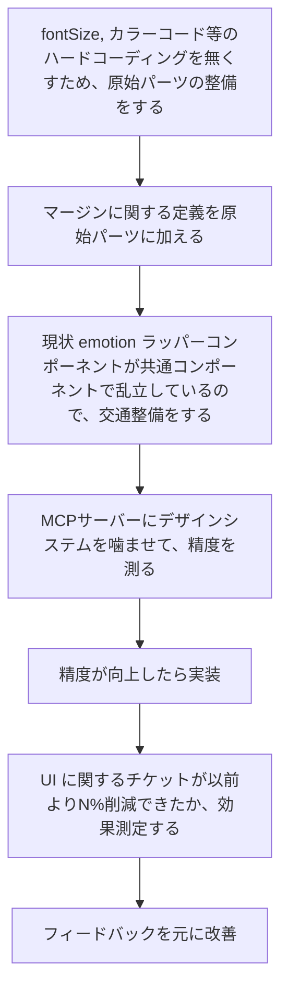
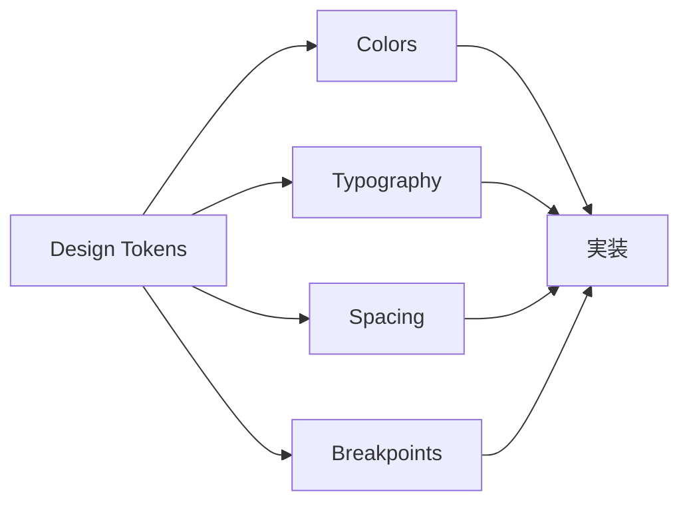

こんにちは！[アルダグラム](https://aldagram.com/about/)でエンジニアをしている kageyama です

最近、「デザインシステムがあれば、この issue は解決する or 産まれなかったかも？」と思うことがありました。

プロダクトが成長すると、ページごとで共通コンポーネントの扱いが若干違ったり、似て非なるコンポーネントが生まれる可能性があったりします。ドメインが違えば、共通コンポーネントも中々手が届かない位置にあったりします。

これらが全てデザインシステムで解決できれば良いと願いつつ、この記事では

- [デザインシステムを作りたいと思った背景](https://www.notion.so/2637b896ef9a8031a3c5c824ff54ca55?pvs=21)
- [デザインシステムがあることのメリット・デメリット](https://www.notion.so/2637b896ef9a808ea385c7ee16596b6a?pvs=21)
- [ミニマム実装には何が必要なのか](https://www.notion.so/2637b896ef9a80a48619db455a2d0def?pvs=21)

を説明していきます。

## デザインシステムを作りたいと思った背景

**はじめに、全ての会社がデザインシステムを必要とは思いません**。プロダクトの機能数や複雑度に応じて、必要なタイミングで揃えれば良いと思っています。

個人的には、UI に関する issue が増えてきたと思ったタイミングで始めても良いと思っています。

**issue 例：**

- 既存コンポーネントは emotion を通じたラッパーの役割で、 AI コーディング時、デザイン、 emotion、ラッパーコンポーネントをコンテキストに入れても中々精度が出ない
- プロダクトで明確なブレークポイントが定まっておらず、デザイナーと毎回議論している
- `8px` ごとのマージン規則があるのに、コード上で 6 の倍数になっていてチグハグになっていた
- カラーコードをハードコードしたばかりに、改修がとても大変
- フォントサイズをハードコードしたばかりに、改修がとても大変
- コンポーネントの再利用性が低く、似たようなコンポーネントが乱立している
- デザイナーとエンジニア間で共通言語がなく、コミュニケーションコストが高い
- etc..

私は、UI コーディングに関して、特に「パーツを増やすことは簡単なである一方、その後の修正や運用がとても大変だな」と感じております。ロジックで解決できるものもあれば、「見た目は、こっちの方が..」といった主観で判断されることも、時にはありえます。

主観による判断を下した場合、次に同じ問題が出会したときに同じ判断をくだす必要があるか/無いか、の議論も必要になります。

デザインシステムが、上記 issue をゼロにするかはそのシステム自体に依存しますが、いくつかは減らせそうです。

デザインシステムのメイン担当になるなら、時間を割いてブラッシュアップし続けていけるでしょう。ただ、実際には、普段の業務 80% + デザインシステム改修 20％ みたいな割合が一般的では無いでしょうか。

なので、「スコープを限定して、ミニマムに展開していく」アプローチだったり、戦略を練ってから進める必要がありそうです。

### 理想的なマイルストーン設定

例えば、最終ゴールが **「デザインシステムを MCP サーバーに噛ませることで、UI コーディングの精度改善が図れた」** としたいなら、マイルストーンは下記のように描けるかもしれません。

ただし、これは理想であって、実目線で見たときにはいくつかメリット・デメリットがあると思います。

## デザインシステムがあることのメリット・デメリット

エンジニア、デザイナー両方の目線で考えてみようと思います。

### メリット 👍

### エンジニア視点

- **開発速度の向上**
  - カタログ化によってハードコードの撲滅
  - props の max 指標を持たせて、別コンポーネントにする/しないといった議論
- **保守性の向上**
  - 一貫性のあるコードベースにより、バグの発生率が低下
  - デザイントークンの一元管理により、全体的な変更が容易に
  - テストの書きやすさが向上（コンポーネントが明確に定義されているため）
- **AI コーディングとの親和性**
  - 明確に定義されたデザインシステムは、AI がコンテキストを理解しやすい（だろう）
  - コード生成の精度が向上し、手戻りが減少

### デザイナー視点

- **デザインの一貫性**
  - ブランドアイデンティティの統一
  - ユーザー体験の向上
- **コミュニケーションの効率化**
  - エンジニアとの共通認識
  - プロダクトの実 UI における調査時間の短縮
- **スケーラビリティ**
  - 新機能追加時の検討事項が明確
  - デザインの拡張が計画的に行える

### デメリット 👎

### エンジニア/デザイナー視点

- **初期投資コスト**
  - 時間的コスト
    - 既存コンポーネントの棚卸しと整理
    - ドキュメント作成
    - チーム内での合意形成
- **学習コスト**
  - メンバーが慣れるまでの時間
- **メンテナンスコスト**
  - 継続的な更新が必要
  - 破壊的変更時の影響範囲が大きい

デメリット側の初期投資コストは一時的なので、メリットと比較するべき対象は「運用コスト」になりそうです。この辺は、UI に関連する issue がどれほど溜まっているか、あるいは解決できたときの売上インパクトがどのくらいか、などが分かった上で比較しても良いかもしれません。

ただし、長期的な目線で見たとき、大きいプロダクトであればあるほど、デザインシステムは資産として大きく活躍してくれるとは思います 👍

## ミニマム実装には何が必要なのか

いきなり巨大なデザインシステムを作ろうとすると、1 年はかかりそうです。

どの程度 UI に関連する issue 率を減らしたいか、デザイナー x エンジニア間で共通認識をとりたいか、などを考えスコープを切らないと、全てをシステムに落としたくなりそうで前途多難になります。

デザインシステムに多くの時間を割けれない場合、まずは**ミニマムでリリースして徐々にブラッシュアップする形が進めやすいのでは**と個人的に考えています。

### ミニマムの前に：他社事例の調査

ミニマムを考える前に、他の事例を探ってみてスコープを決めていきます。

私が思うにパブリックになっているものを一旦のデフォルト or マキシマムと捉えようと思います。

### デジタル庁の事例

[デジタル庁では β 版をリリース](https://design.digital.go.jp/)していますが、既にリッチなデザインシステムが存在します。

デジタル庁では、

- **基本デザイン構成**：8 つ
  - カラー
  - タイポグラフィ
  - アイコン
  - レイアウト
  - リンクテキスト
  - 余白
  - 角の形状
  - エレベーション（ブラウザ上で表示されるコンポーネントの高さの度合い）
- **コンポーネント**：35 個

存在することが分かります。シンプルながら、各ページでは見やすい内容で展開されていることが分かります。

### ミニマム実装の定義

デジタル庁に倣って全てやっても、半年はかかりそうです。削れる箇所は削ってしまいたい。

例えば、下記のような構成で進められると、上述していた issue は全て削除できそうです 📝

### Phase 1: プリミティブなデザインパーツ（1 ヶ月）

1. **カラーパレット**
   - Primary, Secondary, Error, Warning, Success, Info
   - 透明度
   - 背景色、テキスト色
   - パレット定義
2. **タイポグラフィ**
   - フォントファミリー
   - フォントサイズ（h1-h6, body, caption 等）
   - 行間、文字間隔
   - パレット定義できれば、ハードコードを辞めることができる
3. **スペーシング**
   - 8px グリッドシステム
   - マージン・パディングの規則
   - コンポーネント間の余白ルール
4. **ブレークポイント**
   - モバイル、タブレット、デスクトップの定義
   - レスポンシブデザインの基準

### Phase 2: 基本コンポーネント（1 ヶ月）

1. **アイコンカタログ**
   - そのアイコンが今までに利用されたことがあるか無いか確認できる
   - 似たアイコンを作らないようにできる
   - 命名規則の統一
2. **ボタン**
   - Primary, Secondary, Tertiary
   - サイズバリエーション（small, medium, large）
   - 状態（default, hover, active, disabled, loading）
3. **フォーム要素**
   - TextField, Select, Checkbox, Radio
   - バリデーション表示
4. etc..（細かい部分は後から付け足す）

→ 計 2 ヶ月でミニマム実装として、あとは横展開するイメージでしょうか。

この辺は、実際にミニマムでデザインシステムを構築した方から意見を聞いてみたいところです。

## まとめ

デザインシステムは、単なる UI コンポーネントの集合ではなく、**チーム全体で共有する価値観と原則の具現化**です。

段階的なアプローチでデザインシステムを構築して以下の実現を目指していきたいです。

1. **開発効率の向上** - コンポーネントの再利用と AI ツールとの連携
2. **品質の向上** - 一貫性のある UI と保守性の高いコード
3. **チームの成長** - 共通言語の確立とナレッジの蓄積

もちろん、継続的な改善と、チーム全体でのコミットメントが成功の鍵となります。

もっとアルダグラムエンジニア組織を知りたい人、ぜひ下記の情報をチェックしてみてください！
