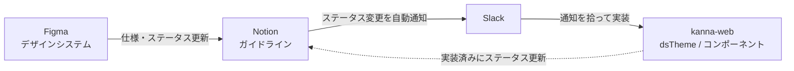
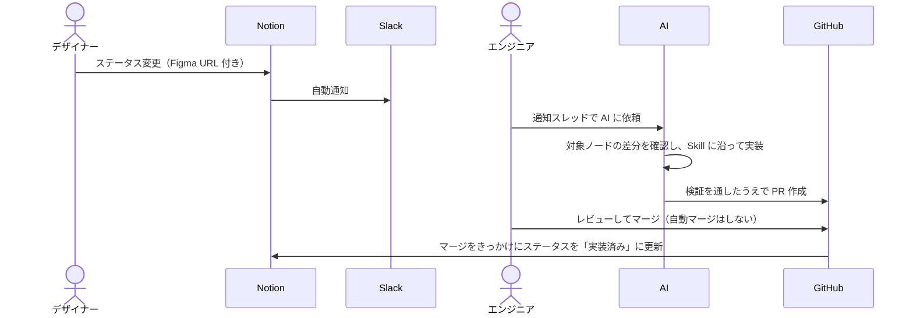

こんにちは！アルダグラムでエンジニアをしている kageyama です

今回は、弊社が開発しているアプリ「KANNA」の Web フロントエンドに **デザインシステムを導入した話** を書きます。

# 結論：Figma を「正」にして、人間も AI も迷わず実装できる土台を作った

KANNA の Web（kanna-web）に、次の 3 つをセットにしたデザインシステムをリリースしました。

1. **Figma デザインシステムを唯一の正（SoT）にする**：デザイナーが管理する Figma のトークン・コンポーネントを、kanna-web 側では MUI の theme（`dsTheme`）とコンポーネントとして追従させる
2. **変更の伝わり方を仕組みにする**：Notion のステータス変更 → Slack 自動通知 → 当番のエンジニアが実装、という連携ラインを運用する（AI による半自動化はこれから）
3. **AI エージェントにも使える形にする**：Figma MCP と Agent Skills（AI コーディングエージェントに手順書を渡す仕組み）を用意し、AI でもデザインシステムに沿った実装と Figma との差分検証ができるようにする

ゴールは「**UI/UX コーディングの品質と開発速度を最大化すること**」です。

# 理由：継続的開発によって、UI の「揺らぎ」と修正コストが積み上がっていた

KANNA は複数チームが並行して開発しています。有り難いことに、沢山のユーザー様から機能要望や フィードバック をいただいており、開発メンバーがそれぞれに対応しています。ただ、並行開発する以上、次のような課題が徐々に溜まっていました。

| 課題                                        | 具体的に起きていたこと                                                                                                                              |
| ------------------------------------------- | --------------------------------------------------------------------------------------------------------------------------------------------------- |
| **画面ごとのデザインが揃わない**            | `#00A26A` と `#00A36A` のような「ほぼ同じ色」や、ばらばらの余白が混ざっていた。見た目が同じコンポーネントが、別々のスタイルで重複して実装されていた |
| **共通言語がない**                          | 命名やプロパティがデザインと実装で一致せず、デザイナーとエンジニアのやり取りに手間がかかっていた                                                    |
| **変更コストが高く、デグレしやすい**        | テーマカラーや角丸を全体で変えるには、全箇所を個別に直す必要があった。影響範囲がつかみにくく、修正漏れが起きやすかった                              |
| **スタイリングが属人化している**            | CSSに関しては「正解」となる基準がなく、実装が個人の経験に頼っていた。                                                                               |
| **デザインが MUI 前提で作られていなかった** | 実装側では以前から MUI を採用していましたが、デザイナーと連携が取れておらず、作成されたデザインは MUI ベースに置き換えられていた                    |

よくある課題が挙がっていると思いますが、これらは、共通コンポーネントを「部品集」としてまとめるだけでは解決しません。**デザインの「意図」と「実装」を同期させ続ける仕組み**が必要でした。

デザイナーが先行して Figma 上でデザインシステムの構築を進めていたので、それを kanna-web としっかりつなぐことにしました。

# 具体例：何をどう作ったか

ここからは、実際に作ったものを 8 つの観点で紹介します。

## 1. 全体像：4 つのツールの役割を分けた

デザインシステムは「デザイナーが管理する Figma 側」と「それに追従する kanna-web 側」の 2 つがあります。この 2 つをつなぐため、ツールごとに役割と担当を決めました。

| ツール                        | 担当                    | 役割                                                                                                               |
| ----------------------------- | ----------------------- | ------------------------------------------------------------------------------------------------------------------ |
| ①Figma デザインシステム       | デザイナー              | MUIベースに作る。トークン（Variables）とコンポーネントを作成・運用する。**実装とずれたら Figma を正とする**        |
| ②デザインシステムガイドライン | デザイナー              | トークン・コンポーネントの仕様（使いどころ、Do / Don't）とステータスを管理する。エンジニアは実装状況の管理にも使う |
| ③Slack                        | デザイナー / エンジニア | ステータス変更を自動で通知する。デザインシステムの修正コミュニケーション場                                         |
| ④kanna-web                    | エンジニア              | MUI 準拠になった Figma デザインシステムに揃えていく。                                                              |

既存トークン・コンポーネントを修正し、画面側で使う。
カタログは Storybook で管理 |



**①Figma デザインシステム**


**④kanna-web (Storybook カタログ)**


## 2. トークン：Primitive と Semantic の 2 層に分けた

トークンは 2 層で定義しています。

- **Primitive**：色コードやピクセル数など、値そのもの。例：`kannaGreen[500]`（ブランドの基準となる緑）
- **Semantic**：「どんな場面で使うか」という意味を持たせたトークン。例：`semanticText.primary`（本文の文字色）、`semantic.border.default`（標準の枠線色）

コンポーネントには Semantic を当て、Primitive は直接使いません。「この色を塗る」のではなく、「この役割の色を使う。結果としてどの色になるかはトークンが決める」という考え方です。

こうしておくと、たとえば「ブランドの緑を少し青みに寄せたい」ときも、**Semantic の参照先を変えるだけで、Semantic トークンを参照している箇所すべてに一括反映**できます（色定数で書かれたままの既存箇所は、8 章の移行でトークン参照に置き換えてから効くようになります）。「理由」で挙げた変更コストの課題に直接効くところです。

## 3. dsTheme：MUI theme として配り、適用は 1 か所だけにした

kanna-web は MUI を使っているので、デザインシステムを MUI の theme（`dsTheme`）として提供しています。Figma 側のコンポーネント構成も MUI に揃えたため、デザインと実装の対応が取りやすくなっています。

`dsTheme` はアプリのルートで 1 回だけ適用しています。

```tsx
// pages/_app.tsx（抜粋）
import { dsTheme } from "@ui/designSystem/theme/dsTheme";

<ThemeProvider theme={dsTheme}>
  <ApolloProvider client={apolloClient}>
    {/* ... アプリ全体 ... */}
  </ApolloProvider>
</ThemeProvider>;
```

スタイルが参照する theme は一番近い親の `ThemeProvider` で決まるため、入れ子にすると意図しない theme を参照してスタイルが崩れる恐れがあります。Storybook も同じ `dsTheme` を decorator で当てており、Storybook と本番で前提が揃います。

また、開発する前に、事前にデザイナーと Figma 側のデザインシステムは MUI 公式の構造と揃えていこう、という認識を合わせたおかげでコンポーネントの構造も Figma / MUI / 実装とで揃えることができました。


## 4. 型の工夫：makeStyles をあえて 2 系統にした

既存コードは `tss-react/mui` の `makeStyles` を使っています。そこでデザインシステム用に `dsMakeStyles` を別途用意しました。

| import 元                                   | theme の型         | `theme.palette.semantic`        | 使いどころ                           |
| ------------------------------------------- | ------------------ | ------------------------------- | ------------------------------------ |
| `tss-react/mui`（旧）                       | MUI 標準の `Theme` | ❌ 型にない（コンパイルエラー） | 既存コード                           |
| `@ui/designSystem/theme/dsMakeStyles`（新） | `DsTheme`          | ✅ 型安全に参照・補完できる     | 新規実装 / DS トークンを参照する箇所 |

```tsx
// ✅ 新規実装・DS トークンを使うとき
import { makeStyles } from "@ui/designSystem/theme/dsMakeStyles";

const useStyles = makeStyles()((theme) => ({
  root: {
    color: theme.palette.semanticText.primary,
    backgroundColor: theme.palette.semantic.background.gray,
    border: `1px solid ${theme.palette.semantic.border.default}`,
  },
}));
```

MUI の `Palette` 型をグローバルに拡張すれば 1 系統で済みます。ですがそうすると、`dsTheme` が当たっていない場所でも型の上では `theme.palette.semantic` が「ある」ことになり、実行時に `undefined` で落ちるケースを型で防げなくなります。

そこで、拡張は入力側の `PaletteOptions` だけに当て、DS 固有のフィールドを読めるのは `DsTheme` 型（＝ `dsMakeStyles` 経由）のときだけにしました。既存ファイルで DS トークンを使いたくなったら、**import を 1 行差し替えるだけ**で移行できます。

```diff
- import { makeStyles } from 'tss-react/mui'
+ import { makeStyles } from '@ui/designSystem/theme/dsMakeStyles'
```

## 5. コンポーネント：stories と map を同じ場所に置いた

ディレクトリ構成は次のとおりです。

```
src/ui/designSystem/
├── theme/
│   ├── dsTheme.tsx            # デザインシステム用 theme
│   ├── dsThemeAugmentation.ts # DsTheme 型・MUI 型拡張
│   └── dsMakeStyles.ts        # DsTheme 前提の makeStyles
├── tokens/                    # トークンと Storybook ショーケース
└── components/                # 各コンポーネント（*.stories.tsx と *.map.ts を同階層に配置）
```

各コンポーネントの隣には、Storybook の `*.stories.tsx` と、Figma のコンポーネントとコード側のコンポーネントの対応を書いた `*.map.ts` を置いています。`*.map.ts` があることで、人間も AI も「この Figma の部品は、コードではどれか」をすぐに引けます。

実装するときは、対象のコンポーネントがどの状態にあるかで対応を分けます。

| 状態                     | 対応                                             |
| ------------------------ | ------------------------------------------------ |
| デザインにも実装にもある | 既存の DS コンポーネントをそのまま使う           |
| デザインだけある         | ガイドに沿って実装し、map に登録する             |
| 両方あるが差分がある     | Figma を正として実装側を直し、差分検証で確認する |
| どちらにもない           | デザインと実装を並行して進める                   |

## 6. デザイナーとの連携：ステータスで動かし、逆流させない

デザインシステムを運用していく上で議論になったのが「実装中に、デザインシステムに足りないものに気づいたらどうするか」です。これは、最適解が見つけづらく、現状の結論は **実装側から Figma へは逆流させない** ことにしました。

- デザインシステムは汎用的なコンポーネントをまとめたものなので、デザインが先にある場合は Figma を正とする
- 足りないものに気づいたらデザイナーに連携し、コード側で Figma を上書きしない
- 工程表のような画面専用のコンポーネントは、あえてデザインシステムに載せない

「どちらが正か」を 1 つに決めておくことで、判断に迷う場面がかなり減りました。

## 7. AI 活用：コンテキストを設計し、Agent Skills を 3 つ用意した

AI エージェントに実装を任せるには、AI が「どこを読めば正解がわかるか」を決めておく必要があります。そこで、情報の置き場所ごとに AI への渡し方を決めました。

| 置き場所     | 人間にとって                 | AI への渡し方                                               |
| ------------ | ---------------------------- | ----------------------------------------------------------- |
| Figma        | デザインの意図・見た目の正解 | Figma MCP でトークン名と値を直接取得する                    |
| Storybook    | コンポーネントの挙動の正解   | リポジトリの `*.stories.tsx` / `*.map.ts` を読ませる        |
| Notion       | 思想・背景・運用の正解       | Notion MCP で原則やガイドラインを読ませ、ガードレールにする |
| コードベース | 最終成果物                   | `CLAUDE.md` と Agent Skills で規約と手順を渡す              |

そのうえで、次の 3 つの Agent Skills を用意しました。

| スキル                  | 入力                           | やること                                                                                                                                                                                               |
| ----------------------- | ------------------------------ | ------------------------------------------------------------------------------------------------------------------------------------------------------------------------------------------------------ |
| `ds-variables-to-code`  | Figma Variables の JSON export | トークン（Primitive 層）をコードに反映し、既存値との差分を検出する                                                                                                                                     |
| `ds-components-to-code` | Figma のコンポーネント 1 つ    | `dsTheme` への MUI overrides 追加 → Storybook story 作成 → `pnpm ds verify-pixel` で寸法を計測して Figma と照合（目安 3 回まで修正）→ map 登録までを一気に行う                                         |
| `figma-to-code`         | Figma の URL                   | map で使えるコンポーネントを解決 → 足りない部品は `ds-components-to-code` に任せる → ページ実装 → Playwright で撮ったスクリーンショットを Figma と見比べ、要素の位置・寸法のずれが 10px 以内か検証する |

ポイントは 2 つあります。

- **検証までをスキルに含めた**：AI が「それっぽいコード」を書いて終わるのではなく、コンポーネント単体は寸法を Figma と突き合わせ、ページ全体は Playwright で撮ったスクリーンショットを Figma と見比べ、要素の位置・寸法のずれが 10px 以内に収まるまで直します。なお、Figma と Chromium ではフォントの字送りが構造的にずれるため、画像同士のピクセル一致（差分率）は合否の基準にしていません
- **AI に勝手に作らせない**：`CLAUDE.md` で「Figma や Storybook にないコンポーネントを、AI の判断で新しく作らない」と明記しています。各スキルも `disable-model-invocation: true` にして、人が明示的に呼んだときだけ動くようにしています。逆にいえば、エンジニアごとのやり方は強制しないことで柔軟性を持たせています

## 8. 既存コードとの共存：theme は一括で切り替え、スタイルの書き方は段階的に移す

theme は 3 章のとおり `_app.tsx` で一括適用済みなので、残る課題は各コンポーネントのスタイル定義です。旧 `makeStyles`（`tss-react/mui`）で書かれたコンポーネントも実行時は `dsTheme` を受け取っていますが、型は MUI 標準の `Theme` のままなので、Semantic トークンを型安全に参照するには 4 章の import 差し替えが要ります。

スタイルの書き方は次の方針で移行しています。

- **新規画面・新規コンポーネント**：最初から `dsMakeStyles` と Semantic トークンで書く（まずは施工管理機能の KANNA プロジェクトから）
- **既存ファイル**：触るタイミングで import を `dsMakeStyles` に差し替え、色定数を Semantic トークンに置き換える。置き換えは Figma 側で対応するトークンが確定しているものから進める

デザイナーも 2026 年 7 月からデザインシステムのトークン・コンポーネントを使ってデザインを作り始めており、新しい画面から少しずつデザインシステムで作られた UI が増えています。

# 新 theme を一括適用するにあたり実施したこと

`dsTheme` を `_app.tsx` に当てると、MUI コンポーネントを使っている全ページの見た目が同時に変わります。段階的に当てる選択肢もありましたが、次の 2 点から一括適用に踏み切りました。

**1. HTML 構造を壊す変更がほとんどなかった**

今回の theme は、MUI の `components` に対する styleOverrides（色・余白・角丸・フォント）が中心で、DOM 構造や className を変える変更はほぼありません。既存ページは MUI コンポーネントをそのまま使っているため、theme を差し替えても「要素が消える」「レイアウトの箱が入れ替わる」といった破壊的な変化は起きず、起きるとしても「色や余白が Figma 側の値に寄る」範囲に収まります。影響の種類が限定されていたからこそ、全ページを一度に切り替える判断ができました。

**2. デザイナー陣と肩を組み、全ページのレイアウト崩れをチェックした**

とはいえ余白や色が全ページで一斉に変わるので、見落としは怖いところです。そこでリリース前に、デザイナーとエンジニアで KANNA の全ページを新 theme で開き、レイアウト崩れや意図しない見た目の変化がないかを確認しました。

実際に見つかって直したものの例です。

- 背景色や追加ボタンが theme の既定値に引きずられ、以前と見た目が変わっていた
  - → 画面側で適用前の見た目に戻した
- Select の余白が outlined 以外の variant にも当たっていた
  - → 適用範囲を outlined に限定した
- Button の Large の min-width と Medium 系の左右 padding が Figma とずれていた
  - → theme の override を修正した

「Figma が正」とはいえ、既存画面には Figma 側にまだデザインがない箇所もあります。そこは「デザインシステム適用前の見た目を維持する」を基準にし、デザイナーが Figma 側を整えてから追従する形にしました。

# これから：自律型 AI による半自動連携

今後は、Figma の変更に「人が手で実装する」部分を減らしていきたいです。Notion のステータス変更をきっかけに、自律型 AI が差分の確認から PR 作成までを担当し、**人間はレビューに回る**形を目指しています。



AI に判断を任せすぎないよう、「PR を出すか、Issue で止めるか」はルールとして決めています。

- 登録済みコンポーネントのスタイル差分 → 検証を通したうえで PR を出す
- トークン値の変更のみ → コード生成で反映する
- まだ登録されていない新規コンポーネント → Issue で止め、人が方針を決める
- Figma の構造が読み取れない / 検証を通せない → 調査結果を Issue に残して止める

新規コンポーネントを Issue で止めるのは、「Figma が正」「AI の判断で新しく作らない」という原則と揃えるためです。

最終的には、レビューは人間に残しつつ、Figma の変更がほぼ自動でコードに追従する状態にしたいですね。

# まとめ：デザインシステムは「部品集」ではなく「同期の仕組み」

もう一度結論です。今回のデザインシステムは、UI コンポーネントを集めたカタログではなく、**デザインと実装を同期し続けるための仕組み**として作りました。

作ってみてわかった大事なポイントは次の 4 つです。

1. **正（SoT）を 1 つに決める**：Figma デザインシステムを正とし、逆流させない。迷う場面が減る
2. **型で守る**：`dsMakeStyles` のように、「使ってはいけない場所で使えない」状態を型で作る
3. **AI に渡すコンテキストを設計する**：Figma / Storybook / Notion / コードベースのどこに何の正解があるかを決め、検証までをスキルに含める
4. **theme は一括、スタイルは段階的に**：`dsTheme` は全ページに一括で当て、スタイル定義は新規画面から始めて、触ったところから置き換える

デザイナーとエンジニア、そして AI が同じ前提で UI を作れる状態を、これからも育てていきます。

もっとアルダグラムエンジニア組織を知りたい人、ぜひ下記の情報をチェックしてみてください！
