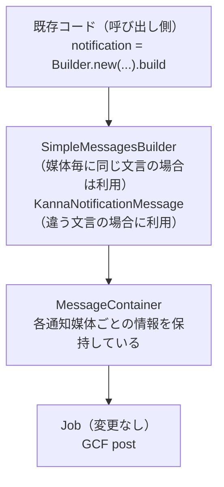

こんにちは、[アルダグラム](https://aldagram.com/about/)でエンジニアやってる kageyama。

機能改修をするとき、そもそもどう改修しようか悩むことがあります。

- 後方互換性を保ちながら、今の要件にも合わせる
- API versioning を採用して、別設計を並行で持たせる
- その他、全く違う方法..

上記を意識せず改修してしまうと設計がぐちゃるので、使い分けたいは意識したいところ。
今回は KANNA の通知基盤を改修する中で、**API versioning を採用して既存/新規を並行させよう**と判断し、v1/v2 を設けることに決めました。

この記事では、通知基盤 v2 を題材に「どういうときに v2 を切るべきか」を、判断基準と実際の設計例を共有していきます。

※なお、通知 v2 は外部に公開するものでなく、システム内でのみ呼ばれる API なので、外部公開するケースには沿わないことがあると思います。

## 既存の通知機能のメリット・デメリット

KANNA では、案件の状態が変化したとき等をトリガーに、関連するユーザーに該当通知を送る機能が存在しています。その数は 10 本以上になります。


通知は、最終的には FCM / Sendgrid などを経由してユーザーに届けられるのですが、それらをまとめて管理している API モジュールを用いて、最終的にはイイカンジに Firebase を経由して通知処理をしてくれます。

そのため、新しい通知が必要になったときでも、API の改修をするだけで事が済んでいました（しかも、resend 機能なども内包しており素晴らしい！）。

参考に、現状の通知フローをザックリ載せます。

- 現状の通知フロー

  ```mermaid
  sequenceDiagram
      participant API as KANNA API
      participant Sidekiq as Sidekiq Queue
      participant Job
      participant GCF as Google Cloud Functions
      participant Queue
      participant Trigger
      participant Transfer
      participant FCM as Firebase Cloud Messaging
      participant SendGrid as SendGrid
      participant Firestore as Firestore
      participant Web

      API->>API: 通知Requestを作成
      Note over API: インスタンス生成
      API->>Sidekiq: 非同期処理
      Sidekiq->>Job: 非同期実行
      Job->>Job: メッセージを人数に応じて分割
      Job->>GCF: POST

      GCF->>GCF: バリデーション
      GCF->>Queue: Queueにアイテム追加
      Note over Queue: 各ユーザー・各チャネルごとに<br/>QueueItemを作成
      Queue->>Trigger: トリガー発火
      Trigger->>Transfer: transfer処理

      alt Push通知
          Transfer->>FCM: プッシュ配信処理
          FCM-->>Transfer: 配信結果
      end

      alt メール通知
          Transfer->>SendGrid: メール配信処理
          SendGrid-->>Transfer: 配信結果
      end

      alt KANNA内お知らせ
          Transfer->>Firestore: KANNA内配信処理
      end

      alt デスクトップ通知
          Web->>Queue: onSnapshot でリアルタイム監視

          Queue-->>Web: 新規QueueItem検知
          Web->>Web: ブラウザ通知を表示
          Web->>Queue: pushResult を更新
      end

      Transfer->>Queue: 配信結果を記録

  ```

一方、下記のような問題も抱えていました。

- 通知の内容は通知媒体（プッシュ通知・デスクトップ通知・メール通知・アプリ内通知）ごとに文言をカスタマイズすることが **できないため、** 拡張性の面で不都合が生じている。
  （例：メール通知では、親案件の情報を載せたいとか）
- プッシュ通知・デスクトップ通知で閲覧可能なメッセージが最大でも 200 文字程度なので、メッセージ量がそれに引っ張られてしまう。
- メールテンプレートが固定化されており、field 名も固定化されているため、field 名と沿わない内容を入れなければいけないケースが生じている

文言を通知媒体ごとにカスタマイズできないので、どうしてもシンプルなメッセージに留まってしまう。そのため、改修の余地がありました。

## デメリットの解消に向けて

これらの課題から、下記のような方針をチーム内で決めていきました。

- 通知媒体に応じたメッセージのカスタマイズができるようにする
  - プッシュ通知・デスクトップ通知の 200 文字問題も解消される
- メールテンプレートは、API から指定できるようにして柔軟に対応させる
- 将来、通知媒体も簡単に増やせるような設計に仕上げる

成し遂げるためには、最初は既存通知処理に改修を加えればイケるかなと思っていました。

ただ、調査していくと、

- 根本的な改修が入るため、既存機能を修正すると分岐処理がかなり混在して複雑化する
- 案件通知が 10 本以上あり、全てを互換性を維持しながら修正するのは工数的にも複雑度的にも難易度が高い
- フィールドの姿も結構変わる
- デバッグとかシンドくなりそう

このような課題があり、冒頭の **「API versioning を採用して既存/新規を並行させよう」** の話につながっていきます。

## 互換対応でいけるパターン / v2 が必要なパターン

「互換性で頑張るべき改修」なのか「設計自由度を取り戻すべき改修」なのか、は議論の余地がありますが、今回は下記の結論に至りました。

### 互換対応でいけるパターン（後方互換性で吸収）

- **optional なフィールド追加**で目的が達成される
- 既存クライアントが新フィールドを無視しても成立する
- 振る舞いの差分が小さく、条件分岐が増えにくい

### v2 が必要なパターン（API versioning で並行運用）

- **フィールドの意味論が変わる**、または payload の形が変わる
- 互換対応で押し切ると **条件分岐が爆発**して保守性が落ちる
- 媒体差分（push/desktop/mail/kanna など）が本質であり、共通化が厳しい

**通知改修は、通知媒体ごとに表現が分かれていくのが本質だったため、互換対応で押し切るより v2 を切るほうが健全だと判断しました。** 記載した課題も概ねクリアできます。

## ディレクトリ構成

v2 を作るときに悩んでいたのがディレクトリ構成でした。
通知は社内向け API で完結しているので、外部公開するものではありません。そのため、 v1 → v2 移行完了タイミングで v1 利用していたモジュールは軒並み削除できます。内部のエンジニアに分かりやすくあれば良いので、その辺はやりやすかったです。

とりあえず、構成はこんな感じになりました。

```markdown
notification_requests
├── v2
│   ├── builder
│   │   ├── simple_messages_builder.rb # 通知媒体で同じメッセージを使用する際に一括生成する Builder。全部の通知文言がガラッと変わるわけではないため、共通文言の場合はこちらを使う。
│   │   ├── upload_documents_builder.rb # 資料アップロード通知の Builder(v2)
│   │   └── utils.rb # builder で必要な utils
│   └── message
│   │   ├── message_container.rb # 通知メッセージコンテナ
│   │   ├── mail_notification_message.rb # 通知媒体用メッセージクラス。メールテンプレート自体が変わるのと、field 数が増減するので、柔軟性を持たせている
│   │   ├── kanna_notification_message.rb # 通知媒体用メッセージクラス
│   │   ├── desktop_notification_message.rb # 通知媒体用メッセージクラス
│   │   ├── push_notification_message.rb # 通知媒体用メッセージクラス
│   ├── formatters
│   │   └── gcf_formatter.rb # gcf 経由で渡す際の formatter
│   └── serializers
│   │   ├── deserializer.rb
│   │   └── serializer.rb
├── v1 系のファイル..
```

- v1 系のファイルは v2 に移行した瞬間に削除できるので、v1 系のファイルは何も触っていないです。
- v2 の存在を理解してくれるように v2/ で切ります。
- ロジックや builder ファイルも全部 v2 内に納めます。v2 内だけで builder が作られるようにします。
- 多言語対応のみ別で yml ファイルがあるので、それらは v2 以外の箇所で一括管理します。

v2 を利用する場合でも、呼び出し側の振る舞いは変わらないです。
中身のメッセージビルダーのみを変えたことで、影響範囲は限定的です。



Firebase 側も同様に v2 を設けて対応していきます。~~書く力が無くなってきたため~~ 割愛しますが、 API からの受け口である Firebase function も v2 用を用意します。
Firestore へ保存されるデータ先は v1 / v2 一緒にしています。それをトリガーにして通知配信が行われるのと、既存フローに乗っかると resend 機能などの恩恵があるため、ここは変えません。
そのため、データを入れる前段の部分でヨシナニしていきます。

結果として、通知基盤となる api, firebase ともに v2 移行ができる仕組みができました 🎉

## まとめ

今回の改修は、単に「メッセージをカスタマイズできるようにする」ものでしたが、副産物として

- 新しい通知タイプが増えても、拡張がしやすくなった
- 既存では、ロジックが API に集約されていなくて WEB / Firebase / App 側で文字を trim するケースがあったが、v2 ではそれが必要なくなった
- 不必要な field が v2 では丸っと消せてシンプルな作りになった

こともあり、結構イイカンジになったんじゃないかって思っています（そう思いたい）。
以上です！

もっとアルダグラムエンジニア組織を知りたい人、ぜひ下記の情報をチェックしてみてください！
